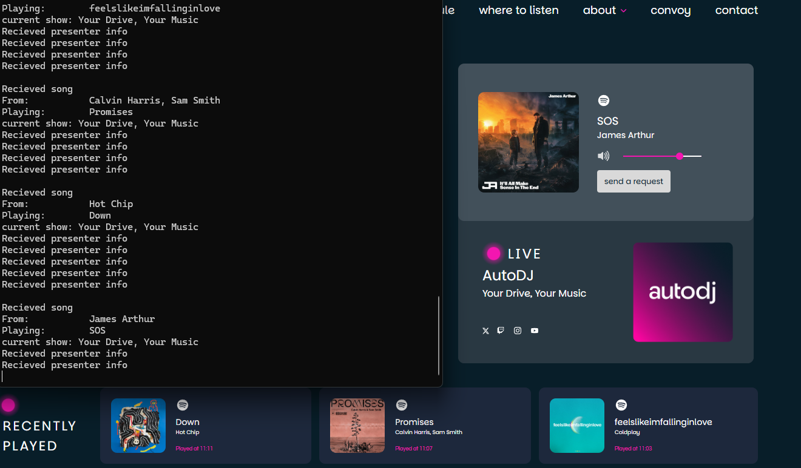

# TrucksFmRealtimeStatus

## Description
  Simple console app that saves information from [Trucksfm](https://truckers.fm/) socket
  - Connects to the socket
  - Socket sends info about what is currently playing, app saves it to DB
  - App also captures which songs belong to what show
  - If song is already saved, app adds a new pair

You can build Docker Image for running it on the server.
My instance has been running around for 7 months, and it has collected over 11k songs, which have been aired across almost 700 shows. The total number of songs played for the last 7 months is over 78k at the time of writing this.

## Setup
  - Initialise DB using the [CreateDB.sql](./CreateDB.sql)
  - Add your connection string to [DbContext](./TruckersFmRealtime/ModelsDB/TruckerFmContext.cs)
  - *optional* (build docker image)
  - Run it